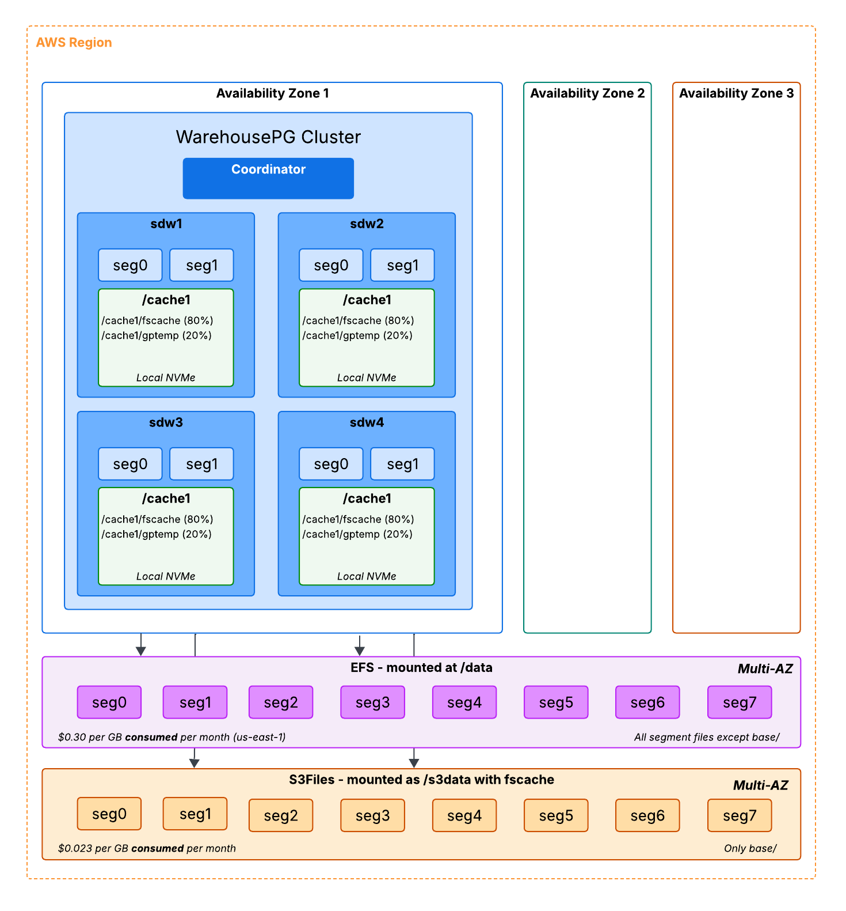

# WarehousePG on AWS

## Overview
This repo contains three different CloudFormation templates: *warehousepg_s3.yaml*, *warehousepg_classic_local.yaml* and *warehousepg_classic_ebs.yaml". The classic templates rely on database mirroring for HA while the newer template uses S3 and EFS to eliminate the need for mirroring.

## Optional: Steps to modify and upload deployment scripts
Note: If you are using `us-east-1` in `EDB-SalesEngineering-SE-EMA`, you should already have access to the bucket `s3://fcto-s3-01` for the Classic template and `s3://fcto-s3-02` for the new template. This is where the scripts have already been copied so you can skip this step.

1. Create a bucket in the region you are wishing to deploy.
2. Log into AWS via Okta and click on Access Keys.

3. Open a terminal and run `aws configure`.
4. On the Access Keys page, copy and paste the access key id, secret access key, and the session token in the terminal window. These are temporary credentials so these will expire after a few hours. Specify the region and you can use any format you want for the output.

5. Change to the UserData directory, change the bucket location to your new bucket, run `./upload.sh`.

## VPC
If you are using `us-east-1` in `EDB-SalesEngineering-SE-EMA`, you can use the VPC `fcto-vpc` else, you need to create or use an existing VPC in your account and region.

You need at a minimum a private subnet configured with a NAT Gateway so that commands like `dnf` and `yum` work. If you only use a private network, you need to specify `FALSE` when setting `InternetAccess`.

Ideally, you also have a public subnet configured. It needs an Internet Gateway so that you can access the coordinator node. Only port 22 will be open to the CIDR range specified with `SSHCIDR`. 

Note: make sure the subnets are in the VPC you choose as parameters. AWS does not have dependent parameters so it will show you a list of all subnets in your region.

### CloudFormation Stack with S3 Storage

Deploys a WarehousePG cluster on AWS into an existing VPC using AWS CloudFormation leveraging local SSD for caching, S3Files for data storage, and EFS for database files other than data.

#### Overview 
* No segment mirroring
* Data stored in S3: 3+ Availability Zones, 11 9's of availability
* Can sustain an AZ failure by deploying new cluster in another AZ in the same Region
* Over 30% less expensive than Classic Template
* Slower initial queries and data loading
* Same query performance as Classic Template (1 and 5 concurrent users and before EBS bursting is exhausted)
* Local NVMe caching so consistent performance even with a busy cluster (no bursting exhaustion)

#### Create Stack
1. In the AWS Console, go to CloudFormation and create a new Stack. Pick "upload a template file" and navigate to the file `warehousepg_s3.yaml` in this repo.

2. Fill out the parameters
- `Stack name`: this is mandatory.

**Deployment Scripts**
- `DeploymentBucket`: name of the bucket where your deployment scripts are.

**WarehousePG Configuration**
- `AccessToken`: the EDB access token for downloading EDB software.
- `DatabaseName`: name of the default database name (PGDATABASE) created

**Compute**
- `NodeType`: specifies the IntancesType in AWS. The instance type has a local SSD drive for caching. 
- `SegmentNodeCount`: 0 to 48 nodes in increments of 2 nodes can be deployed. Setting 0 means it will be a single node and the coordinator and segments will reside there. Setting 2 or larger will enable mirroring and deploy on all nodes.
- `AMI`: The existing AWS AMI ID that is valid for your region. The default is the AMI for Rocky Linux 9 and the scripts have been written for this operating system. Be sure you are subscribed to the AMI before launching the Stack and ideally, use Rocky Linux 9 as that has been tested. NOTE: Do not pick an AMI with LVM enabled.
- `KeyPair`: specifies the existing KeyPair for ssh access to the coordinator node.
- `TimeZone`: sets the TZ on all nodes.

**Network**
- `InternetAccess`: if true, the coordinator node will have access to the Internet.
- `SSHCIDER`: make this as restrive as possible. 0.0.0.0/0 will be removed automatically in EDB's accounts. Only used when InternetAccess is true and only applies to the coordinator node.
- `VPC`: existing VPC to deploy in.
- `PrivateSubnet`: Private subnet where the compute nodes will be deployed.
- `PublicSubnet`: Public subnet where the coordinator node will be deployed. Be sure to deploy both subnets in the same AZ! You can also specify the existing Private subnet here if you don't wish to allow Internet access to the coordinator node.

**Storage**
- `S3StorageBucket`: The existing S3 bucket where the data will reside. You can have multiple clusters using the same bucket but each bucket will have a unique S3 FileSystem. Versioning will automatically be enabled in the bucket with a policy of expiring non-current file versions after 1 day. An S3 file system will be created for this Stack as well as a mount target which will be used by the EC2 instances for the cluster.

#### Delete Stack
Deleting a Stack will remove all of the resources provisioned including the data. AWS recommends using Lifecycle rule to remove a large number of files from a bucket so when a Stack is deleted, a Lifecycle rule is created to remove the bucket path used for the Stack after 1 day.

### CloudFormation Classic Stack with Local Storage

Deploys a WarehousePG cluster on AWS into an existing VPC using AWS CloudFormation leveraging local NVMe storage and databaes mirroring.

#### Overview 
* Segment mirroring
* Data stored in local NVMe storage: 1 Availability Zone
* Can NOT sustain an AZ failure
* Least expensive template 
* Ideal for using with AWS Reserved Instances for deep discounts
* Compare to Redshift DC2 architecture
* Pausing EC2 instances will result in data loss but reboots are fine
* Fixed storage amount and performance characteristics

#### Create Stack
1. In the AWS Console, go to CloudFormation and create a new Stack. Pick "upload a template file" and navigate to the file `warehousepg_classic_local.yaml` in this repo.

2. Fill out the parameters
- `Stack name`: this is mandatory.

**Deployment Scripts**
- `S3Bucket`: name of the bucket where your deployment scripts are.

**WarehousePG Configuration**
- `AccessToken`: the EDB access token for downloading EDB software.
- `DatabaseName`: name of the default database name (PGDATABASE) created

**Compute**
- `NodeType`: specifies InstanceType in AWS. The instance type uses EBS storage only.
- `SegmentNodeCount`: 0 to 48 nodes in increments of 2 nodes can be deployed. Setting 0 means it will be a single node and the coordinator and segments will reside there. Setting 2 or larger will enable mirroring and deploy on all nodes.
- `AMI`: The existing AWS AMI ID that is valid for your region. The default is the AMI for Rocky Linux 9 and the scripts have been written for this operating system. Be sure you are subscribed to the AMI before launching the Stack and ideally, use Rocky Linux 9 as that has been tested. NOTE: Do not pick an AMI with LVM enabled.
- `KeyPair`: specifies the existing KeyPair for ssh access to the coordinator node.
- `TimeZone`: sets the TZ on all nodes.

**Network**
- `InternetAccess`: if true, the coordinator node will have access to the Internet.
- `SSHCIDER`: make this as restrive as possible. 0.0.0.0/0 will be removed automatically in EDB's accounts. Only used when InternetAccess is true and only applies to the coordinator node.
- `VPC`: existing VPC to deploy in.
- `PrivateSubnet`: Private subnet where the compute nodes will be deployed.
- `PublicSubnet`: Public subnet where the coordinator node will be deployed. Be sure to deploy both subnets in the same AZ! You can also specify the existing Private subnet here if you don't wish to allow Internet access to the coordinator node.

**Storage**
- Fixed amount per node
- `i4i.2xlarge` has 1 1.875 TB disk per node
- `i4i.4xlarge` has 1 3.750 TB disk per node
- `i4i.8xlarge` has 2 3.750 TB disks per node

### CloudFormation Classic Stack with EBS Storage

Deploys a WarehousePG cluster on AWS into an existing VPC using AWS CloudFormation leveraging EBS storage and databaes mirroring.

#### Overview 
* Segment mirroring
* Data stored in EBS: 1 Availability Zone, 99.9% of availability
* Can NOT sustain an AZ failure
* Over 30% MORE expensive than new Template
* No caching so initial queries and data loading are quicker than new template
* Same query performance as new Template (1 and 5 concurrent users and before EBS bursting is exhausted)
* EBS bursting can be exhausted with busy cluster and performance slows down

#### Create Stack
1. In the AWS Console, go to CloudFormation and create a new Stack. Pick "upload a template file" and navigate to the file `warehousepg_classic_ebs.yaml` in this repo.

2. Fill out the parameters
- `Stack name`: this is mandatory.

**Deployment Scripts**
- `S3Bucket`: name of the bucket where your deployment scripts are.

**WarehousePG Configuration**
- `AccessToken`: the EDB access token for downloading EDB software.
- `DatabaseName`: name of the default database name (PGDATABASE) created

**Compute**
- `NodeType`: specifies InstanceType in AWS. The instance type uses EBS storage only.
- `SegmentNodeCount`: 0 to 48 nodes in increments of 2 nodes can be deployed. Setting 0 means it will be a single node and the coordinator and segments will reside there. Setting 2 or larger will enable mirroring and deploy on all nodes.
- `AMI`: The existing AWS AMI ID that is valid for your region. The default is the AMI for Rocky Linux 9 and the scripts have been written for this operating system. Be sure you are subscribed to the AMI before launching the Stack and ideally, use Rocky Linux 9 as that has been tested. NOTE: Do not pick an AMI with LVM enabled.
- `KeyPair`: specifies the existing KeyPair for ssh access to the coordinator node.
- `TimeZone`: sets the TZ on all nodes.

**Network**
- `InternetAccess`: if true, the coordinator node will have access to the Internet.
- `SSHCIDER`: make this as restrive as possible. 0.0.0.0/0 will be removed automatically in EDB's accounts. Only used when InternetAccess is true and only applies to the coordinator node.
- `VPC`: existing VPC to deploy in.
- `PrivateSubnet`: Private subnet where the compute nodes will be deployed.
- `PublicSubnet`: Public subnet where the coordinator node will be deployed. Be sure to deploy both subnets in the same AZ! You can also specify the existing Private subnet here if you don't wish to allow Internet access to the coordinator node.

**Storage**
- `DiskEncrypted`: specifies to use AWS encryption on the data volumes.
- `DiskType`: specifies the disk type. SC1 is ideal for testing and ST1 for production. For extremely busy workloads, GP3 can be used but it costs the most.
- `CoordinatorDiskSize`: the data volume on the coordinator. 
- `SegmentDiskSize`: specifies the data volume size on each segment node. Remember you can also specify the number of data volumes per node.

#### Delete Stack
All of the resources provisioned by the Stack will be deleted including the data. Data is persisted on EBS volumes which are immedidately deleted when the Stack is deleted.

## Debugging 
1. You can specify to preserve resources in the Stack so that if it fails, the nodes will be preserved.
2. `ssh` to the coordinator node and `sudo bash`. Then `tail -f /var/log/cloud-init-output.log` to watch the progress of the deployment.

