# WarehousePG on AWS

## Overview
This repo contains CloudFormation templates for deploying WarehousePG and EDB Postgres Distributed (PGD) on AWS.

For WarehousePG, there are three different templates to choose from: *warehousepg_s3.yaml*, *warehousepg_classic_local.yaml*, and *warehousepg_classic_ebs.yaml*. The classic templates rely on database mirroring for HA while the newer template uses S3 and EFS to eliminate the need for mirroring. There is also a *pgd.yaml* template for deploying a PGD cluster.

The general steps for using any of these demos are:
1. Create a VPC (if you don't already have one to deploy into)
2. Subscribe to the Rocky Linux 9 AMI
3. Create a key-pair
4. Launch WarehousePG and/or PGD using the templates in this repo

## Prerequisites

### VPC
Use CloudFormation in the target Region and create a Stack with the `vpc.yaml` template file found in this repository. There is one parameter, which is the Availability Zone. This determines where the two subnets will be located.

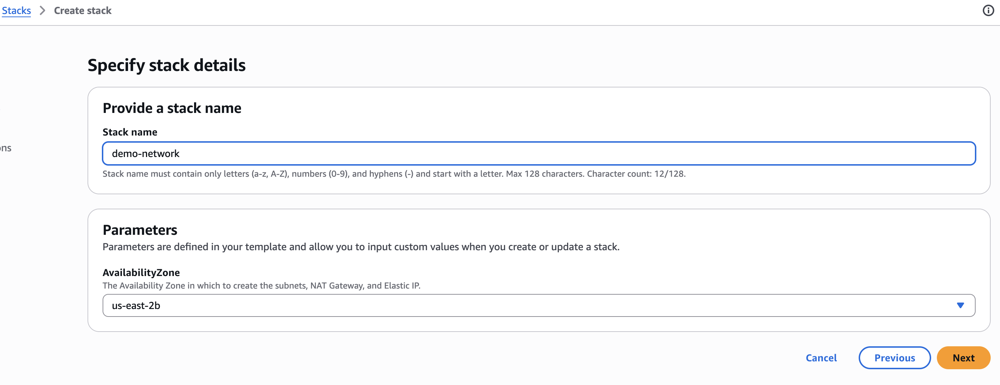

The template creates the VPC, two subnets (public and private), and three gateways (NAT, S3, and Internet). This is only needed if you don't already have a VPC and related resources in the Region you are deploying in.

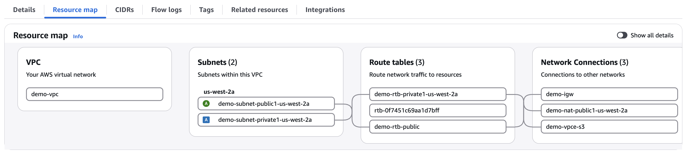

### Rocky Linux 9 AMI Subscription
The CloudFormation templates were designed with Rocky Linux 9, which is freely available via an AMI. In order to use this AMI, you must first subscribe to this product listing.

In the AWS console, go to the AWS Marketplace.

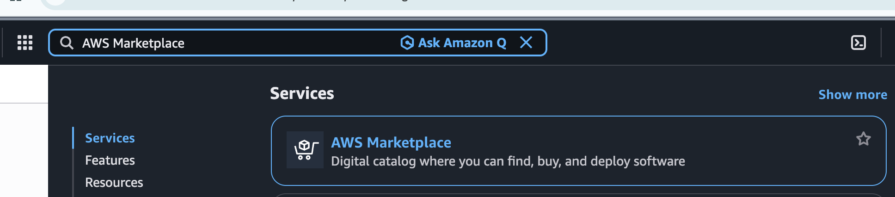

Search for Rocky Linux 9.

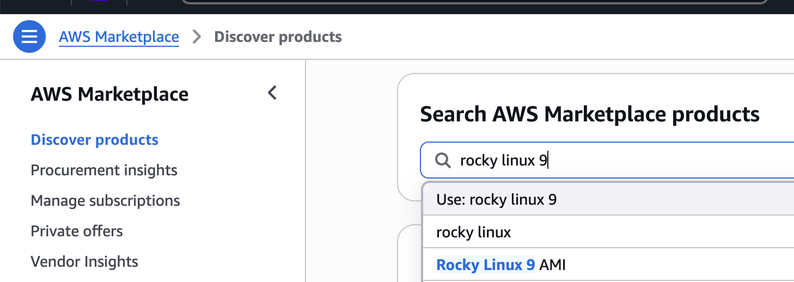

Pick the "Rocky Linux 9 (Official) - x86_64" result by "Rocky Linux".

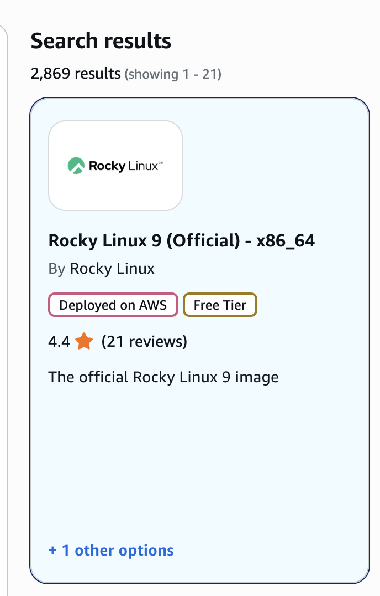

Click on "View purchase options".

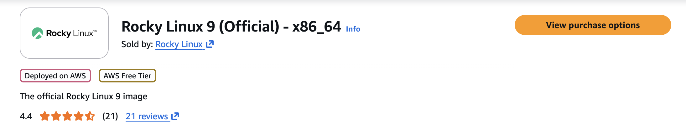

Click on "Subscribe". This is a free product.

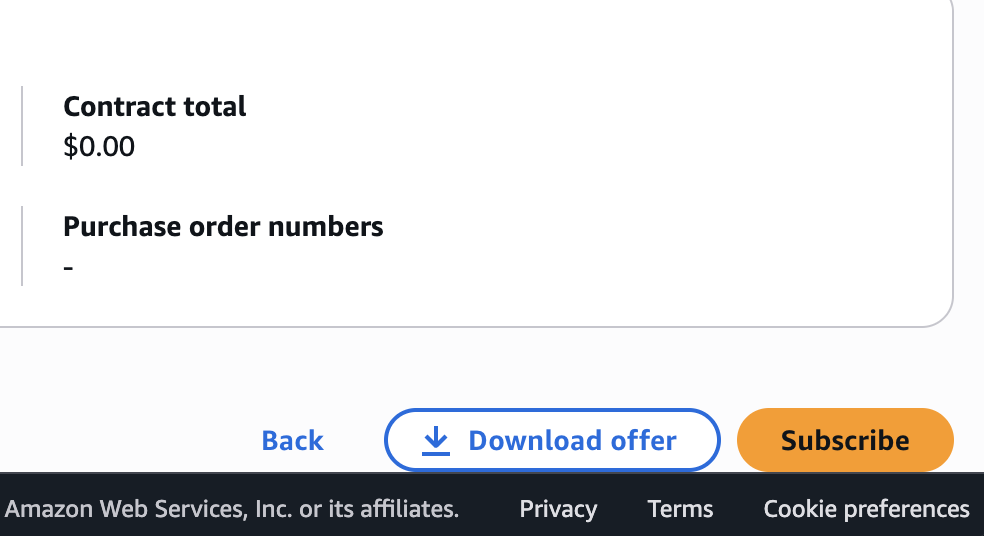

#### Get AMI ID
After subscribing to the Rocky Linux 9 product, you need the AMI ID, which is unique per Region. There are a few ways to find the ID; here is one way using the AWS console.

Go to EC2 and Instances. Click "Launch instances".

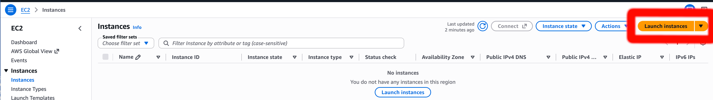

Scroll down to the AMI section and click on "Browse more AMIs".

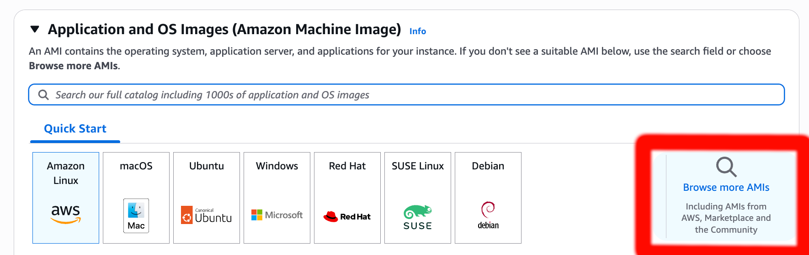

Search for Rocky Linux 9 again and find the product listing you subscribed to earlier. Then click "Select".

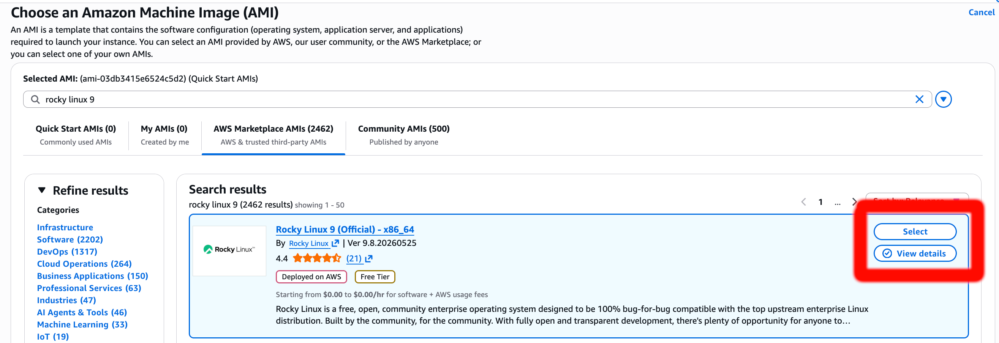

Click "Continue to launch".

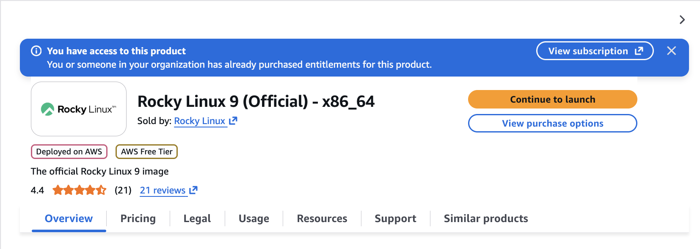

A summary will include the AMI ID. Capture this value and save it for later — you'll need it when launching the WarehousePG or PGD templates below.

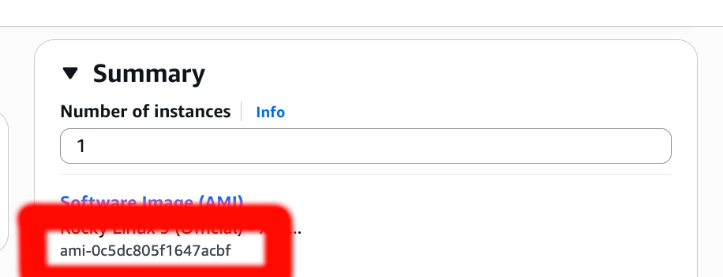

### Key-pair
This is a standard public/private key pair used to connect to AWS instances. Create one in the AWS console under "Key-pair".

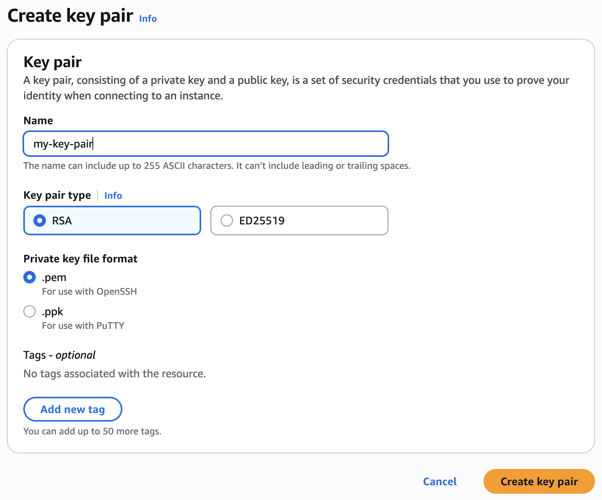

Save the private key it creates in a safe place. It will be used to `ssh` to the EC2 instances that the PGD or WarehousePG templates create.

```
ssh -i my-key-pair.pem rocky@<public_ip_address>
```

## WarehousePG Templates

| Feature | `warehousepg_s3` | `warehousepg_classic_local` | `warehousepg_classic_ebs` |
| --- | --- | --- | --- |
| **Use case** | Cloud storage, pause/resume, and POCs | 24x7 usage, RIs, and most like on-premises | Infrequent to medium busy, pause/resume, and POCs |
| **Cost driver** | Storage scales independently of compute | Fixed to node count — cheapest when storage need ≈ compute need | Pay for provisioned capacity, not consumed |
| **Storage** | S3 + local NVMe cache | Local NVMe | EBS (ST1 or SC1) |
| **Scale storage** | Independently | Add more nodes | Expand EBS volumes |
| **Scale compute** | Elastic or classic resize | Classic (`gpexpand`) | Classic (`gpexpand`) |
| **Pause and resume** | Fully supported | Not supported | Fully supported |
| **HA** | Relies on S3 durability (no segment mirroring) | Segment mirroring | Segment mirroring |
| **AZ failure** | Near 0 RPO | Data loss since last backup copied out of AZ | Data loss since last backup or last EBS snapshot |
| **Region failure** | < 1 hr RPO with S3 replication | Data loss since last backup copied out of Region | Data loss since last backup or last EBS snapshot cross-region copy |

### CloudFormation Stack with S3 Storage

Deploys a WarehousePG cluster on AWS into an existing VPC using AWS CloudFormation, leveraging local SSD for caching, S3 for data storage, and EFS for database files other than data.

#### Overview
* No segment mirroring
* Data stored in S3: 3+ Availability Zones, 11 9's of availability
* Can sustain an AZ failure by deploying a new cluster in another AZ in the same Region
* Over 30% less expensive than the Classic templates
* Slower initial queries and data loading
* Same query performance as the Classic templates (1 and 5 concurrent users, before EBS bursting is exhausted)
* Local NVMe caching so performance stays consistent even with a busy cluster (no bursting exhaustion)

#### Create Stack
1. In the AWS Console, go to CloudFormation and create a new Stack. Pick "upload a template file" and navigate to the file `warehousepg_s3.yaml` in this repo.


2. Fill out the parameters
- `Stack name`: this is mandatory.

**Deployment Scripts**
- `DeploymentBucket`: name of the bucket where your deployment scripts are. Upload the files in this repo's `userdata/` directory to this location. Use the `upload.sh` script to place the files in your bucket.

**WarehousePG Configuration**
- `AccessToken`: the EDB access token for downloading EDB software.
- `DatabaseName`: name of the default database (PGDATABASE) created.

**Compute**
- `NodeType`: specifies the instance type in AWS. The instance type has a local SSD drive for caching.
- `SegmentNodeCount`: 0 to 48 nodes, in increments of 2, can be deployed. Setting 0 means it will be a single node where the coordinator and segments reside together. Setting 2 or larger enables mirroring and deploys across all nodes.
- `AMI`: the existing AWS AMI ID valid for your region — this is the ID you captured in the Prerequisites section above. The default is the AMI for Rocky Linux 9, and the scripts have been written for this operating system. Be sure you are subscribed to the AMI before launching the Stack. NOTE: do not pick an AMI with LVM enabled.
- `KeyPair`: specifies the existing key-pair for SSH access to the coordinator node.
- `TimeZone`: sets the TZ on all nodes.

**Network**
- `InternetAccess`: if true, the coordinator node will have access to the Internet.
- `SSHCIDR`: make this as restrictive as possible. Only used when `InternetAccess` is true, and only applies to the coordinator node.
- `VPC`: existing VPC to deploy into.
- `PrivateSubnet`: private subnet where the compute nodes will be deployed.
- `PublicSubnet`: public subnet where the coordinator node will be deployed. Be sure to deploy both subnets in the same AZ! You can also specify the existing private subnet here if you don't wish to allow Internet access to the coordinator node.

**Storage**
- `S3StorageBucket`: the existing S3 bucket where the data will reside. You can have multiple clusters using the same bucket, but each cluster will have a unique S3 filesystem. Versioning is automatically enabled on the bucket with a policy of expiring non-current file versions after 1 day. An S3 filesystem and mount target are created for this Stack and used by the EC2 instances in the cluster.

#### Delete Stack
Deleting a Stack removes all provisioned resources, including the data. AWS recommends using a lifecycle rule to remove a large number of files from a bucket, so when a Stack is deleted, a lifecycle rule is created to remove the bucket path used by the Stack after 1 day.

### CloudFormation Classic Stack with Local Storage

Deploys a WarehousePG cluster on AWS into an existing VPC using AWS CloudFormation, leveraging local NVMe storage and database mirroring.

#### Overview
* Segment mirroring
* Data stored in local NVMe storage: 1 Availability Zone
* Cannot sustain an AZ failure
* Least expensive template
* Ideal for use with AWS Reserved Instances for deep discounts
* Comparable to Redshift DC2 architecture
* Pausing EC2 instances results in data loss, but reboots are fine
* Fixed storage amount and performance characteristics

#### Create Stack
1. In the AWS Console, go to CloudFormation and create a new Stack. Pick "upload a template file" and navigate to the file `warehousepg_classic_local.yaml` in this repo.


2. Fill out the parameters
- `Stack name`: this is mandatory.

**Deployment Scripts**
- `S3Bucket`: name of the bucket where your deployment scripts are. Upload the files in this repo's `userdata_classic/` directory to this location. Use the `upload.sh` script to place the files in your bucket.

**WarehousePG Configuration**
- `AccessToken`: the EDB access token for downloading EDB software.
- `DatabaseName`: name of the default database (PGDATABASE) created.

**Compute**
- `NodeType`: specifies the instance type in AWS. This instance type uses local storage.
- `SegmentNodeCount`: 0 to 48 nodes, in increments of 2, can be deployed. Setting 0 means it will be a single node where the coordinator and segments reside together. Setting 2 or larger enables mirroring and deploys across all nodes.
- `AMI`: the existing AWS AMI ID valid for your region — this is the ID you captured in the Prerequisites section above. The default is the AMI for Rocky Linux 9, and the scripts have been written for this operating system. Be sure you are subscribed to the AMI before launching the Stack. NOTE: do not pick an AMI with LVM enabled.
- `KeyPair`: specifies the existing key-pair for SSH access to the coordinator node.
- `TimeZone`: sets the TZ on all nodes.

**Network**
- `InternetAccess`: if true, the coordinator node will have access to the Internet.
- `SSHCIDR`: make this as restrictive as possible. Only used when `InternetAccess` is true, and only applies to the coordinator node.
- `VPC`: existing VPC to deploy into.
- `PrivateSubnet`: private subnet where the compute nodes will be deployed.
- `PublicSubnet`: public subnet where the coordinator node will be deployed. Be sure to deploy both subnets in the same AZ! You can also specify the existing private subnet here if you don't wish to allow Internet access to the coordinator node.

**Storage**
- Fixed amount per node
- `i4i.2xlarge` has 1 x 1.875 TB disk per node
- `i4i.4xlarge` has 1 x 3.750 TB disk per node
- `i4i.8xlarge` has 2 x 3.750 TB disks per node

### CloudFormation Classic Stack with EBS Storage

Deploys a WarehousePG cluster on AWS into an existing VPC using AWS CloudFormation, leveraging EBS storage and database mirroring.

#### Overview
* Segment mirroring
* Data stored in EBS: 1 Availability Zone, 99.9% availability
* Cannot sustain an AZ failure
* Over 30% more expensive than the S3 template
* No caching, so initial queries and data loading are quicker than the S3 template
* Same query performance as the S3 template (1 and 5 concurrent users, before EBS bursting is exhausted)
* EBS bursting can be exhausted with a busy cluster, causing performance to slow down

#### Create Stack
1. In the AWS Console, go to CloudFormation and create a new Stack. Pick "upload a template file" and navigate to the file `warehousepg_classic_ebs.yaml` in this repo.


2. Fill out the parameters
- `Stack name`: this is mandatory.

**Deployment Scripts**
- `S3Bucket`: name of the bucket where your deployment scripts are. Upload the files in this repo's `userdata_classic/` directory to this location. Use the `upload.sh` script to place the files in your bucket.

**WarehousePG Configuration**
- `AccessToken`: the EDB access token for downloading EDB software.
- `DatabaseName`: name of the default database (PGDATABASE) created.

**Compute**
- `NodeType`: specifies the instance type in AWS. This instance type uses EBS storage only.
- `SegmentNodeCount`: 0 to 48 nodes, in increments of 2, can be deployed. Setting 0 means it will be a single node where the coordinator and segments reside together. Setting 2 or larger enables mirroring and deploys across all nodes.
- `AMI`: the existing AWS AMI ID valid for your region — this is the ID you captured in the Prerequisites section above. The default is the AMI for Rocky Linux 9, and the scripts have been written for this operating system. Be sure you are subscribed to the AMI before launching the Stack. NOTE: do not pick an AMI with LVM enabled.
- `KeyPair`: specifies the existing key-pair for SSH access to the coordinator node.
- `TimeZone`: sets the TZ on all nodes.

**Network**
- `InternetAccess`: if true, the coordinator node will have access to the Internet.
- `SSHCIDR`: make this as restrictive as possible. Only used when `InternetAccess` is true, and only applies to the coordinator node.
- `VPC`: existing VPC to deploy into.
- `PrivateSubnet`: private subnet where the compute nodes will be deployed.
- `PublicSubnet`: public subnet where the coordinator node will be deployed. Be sure to deploy both subnets in the same AZ! You can also specify the existing private subnet here if you don't wish to allow Internet access to the coordinator node.

**Storage**
- `DiskType`: specifies the disk type. SC1 is ideal for testing, and ST1 for production. For extremely busy workloads, GP3 can be used, but it costs the most.
- `CoordinatorDiskSize`: the data volume size on the coordinator.
- `SegmentDiskSize`: specifies the data volume size on each segment node. You can also specify the number of data volumes per node.

#### Delete Stack
All resources provisioned by the Stack are deleted, including the data. Data is persisted on EBS volumes, which are immediately deleted when the Stack is deleted.

## PGD Template
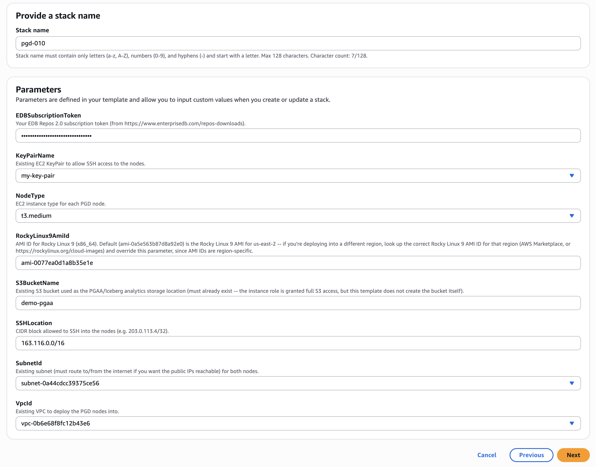

The `pgd.yaml` template deploys a 2-node EDB Postgres Distributed (PGD) cluster and configures PGD Always-On Architecture (PGAA) using the S3 bucket you specify.

*Note: This template is made available to demonstrate the integration of PGD with WarehousePG via PGAA.*

#### Create Stack
1. In the AWS Console, go to CloudFormation and create a new Stack. Pick "upload a template file" and navigate to the file `pgd.yaml` in this repo.
2. Fill out the parameters:

**PGD Configuration**
- `EDBSubscriptionToken`: your EDB Repos 2.0 subscription token (from https://www.enterprisedb.com/repos-downloads).

**Compute**
- `NodeType`: EC2 instance type for each PGD node. Allowed values: `t3.medium` (default), `t3.large`, `t3.xlarge`, `m6i.large`, `m6i.xlarge`, `m5.large`, `m5.xlarge`.
- `RockyLinux9AmiId`: AMI ID for Rocky Linux 9 (x86_64) — this is the ID you captured in the Prerequisites section above. AMI IDs are region-specific, so override the default if you're deploying outside of the template's default region.
- `KeyPairName`: existing EC2 key pair for SSH access to the nodes.

**Network**
- `VpcId`: existing VPC to deploy the PGD nodes into.
- `SubnetId`: existing subnet for both nodes. Must route to/from the internet if you want the public IPs reachable.
- `SSHLocation`: CIDR block allowed to SSH into the nodes (e.g. `203.0.113.4/32`). Make this as restrictive as possible.

**Storage**
- `S3BucketName`: existing S3 bucket used as the PGAA/Iceberg analytics storage location. The bucket must already exist — the instance role is granted full S3 access, but this template does not create the bucket itself.

#### Delete Stack
Deleting a Stack removes the EC2 instances and other resources it provisioned. The S3 bucket used for PGAA storage is not managed by this stack and is not deleted.

## Debugging
1. You can specify to preserve resources in the Stack so that if it fails, the nodes will be preserved.
2. `ssh` to the coordinator node and `sudo bash`. Then `tail -f /var/log/cloud-init-output.log` to watch the progress of the deployment.
