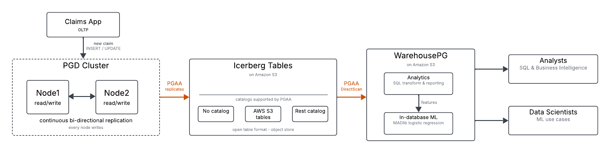

# Setup
These are the scripts that support `PGAA_to_Analytics_and_ML.ipynb` Notebook.
## Architecture

## Instructions
1. Deploy PGD using the CloudFormation templates in this repository. 
2. ssh to one of the nodes using your Key-Pair as user `rocky`.
3. Switch to the `postgres` user. e.g. `sudo su - postgres`
4. Copy the scripts in this directory to the home directory for the `postgres` user.
5. Change the permission of the `setup.sh` script with `chmod 755 setup.sh`.
6. Run setup. e.g. `./setup.sh` and then follow the instructions.
